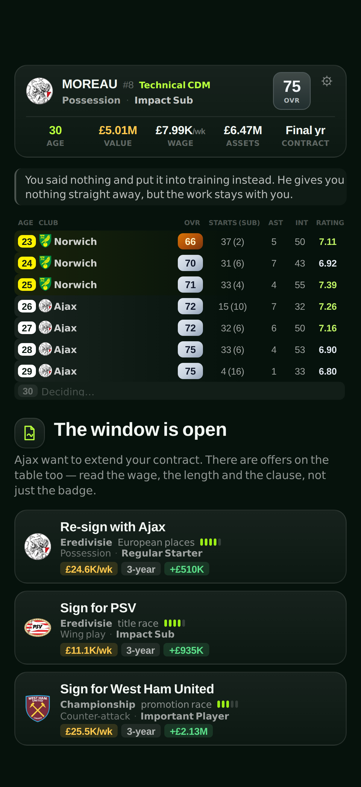
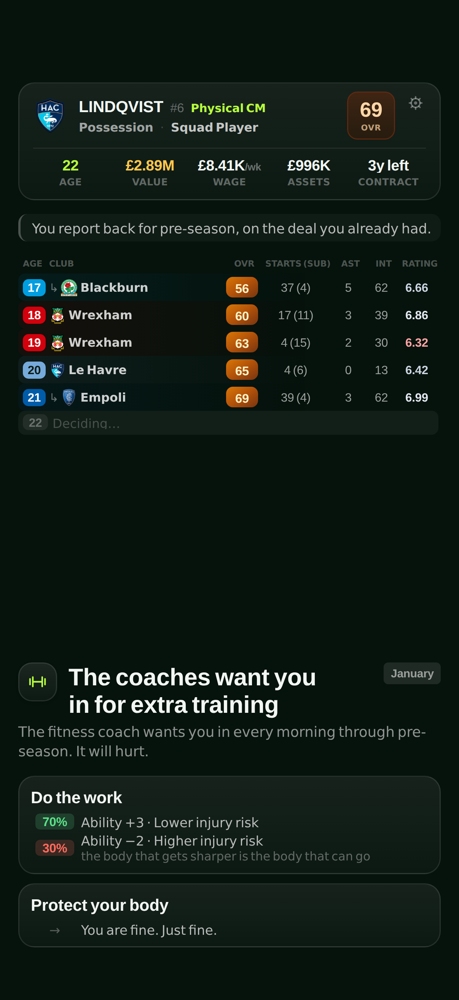
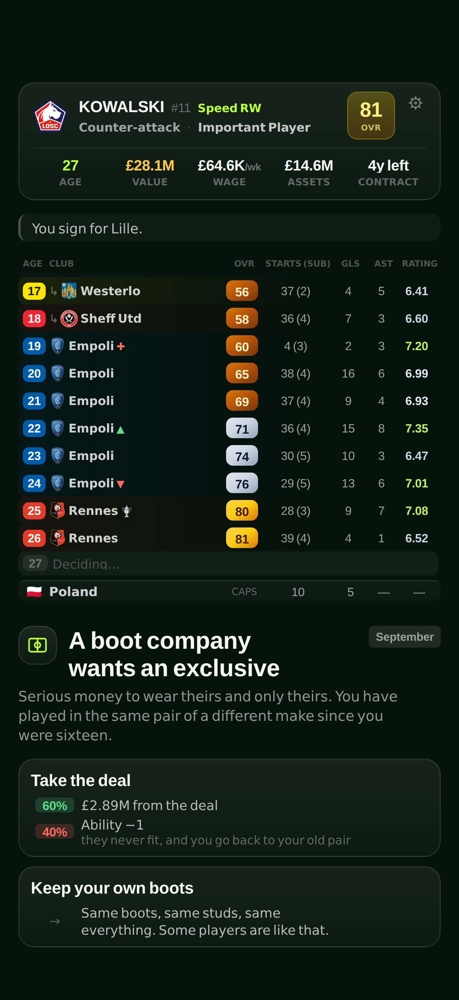
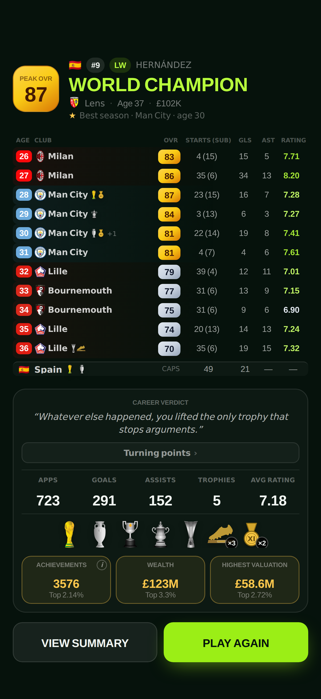

# Decision FC

[](https://github.com/daviesluo/decision-fc/actions/workflows/ci.yml)

A free football career game for phones and computers, in English and Chinese.
You play one footballer from sixteen to retirement, one decision at a time, and
the game plays every season in between. A whole career takes four, six or
eleven minutes.

> **Play it at [decisionfc.com](https://decisionfc.com/)**: free, in the
> browser, no account.

How the game works, on one page: [daviesluo.github.io/decision-fc](https://daviesluo.github.io/decision-fc/).

<table>
  <tr>
    <td align="center" valign="top" width="20%"><br><sub><b>Pick a pace.</b> Four, six or eleven minutes for a whole career.</sub></td>
    <td align="center" valign="top" width="20%"><br><sub><b>Every offer reads as football.</b> The club, its standing, the manager's style and the contract.</sub></td>
    <td align="center" valign="top" width="20%"><br><sub><b>The odds are on the card.</b> Every gamble prints its chances and says why the bad branch is bad.</sub></td>
    <td align="center" valign="top" width="20%"><br><sub><b>Twenty seasons, one row each.</b> Clubs, ability, starts, goals and ratings as they happen.</sub></td>
    <td align="center" valign="top" width="20%"><br><sub><b>Retire and be ranked.</b> An ending, the silverware and three world rankings.</sub></td>
  </tr>
</table>

## What you decide

Decisions come one card at a time, each with two or three options: which
academy to join, which club to sign for, whether to go out on loan, whether to
take a gamble. A club offer trades wage against playing time and the club's
standing. A gamble prints its odds on the card.

Between cards the game plays the season: appearances, goals, injuries,
trophies, wages and market value. There are three leaderboards, for
achievements, career earnings and peak market value, and a daily challenge in
which everyone plays the same world.

The game is built around one question: sign for the bigger club, or go where
you will play. Your role in the squad, six rungs from fringe player to
star, decides how often you play, and your ability decides the role. Every
manager plays one of six styles, and how well your attributes suit his is worth
up to two rating points, either way, when your role is decided. The offer names
the style. Whether it suits you is your call.

## The maths

### Every career can be replayed

Nothing in the engine calls `Math.random` or reads the clock, so the same seed,
the same player and the same choices always give the same career. The dice are
split into about thirty named streams: a season's stats, injuries, trophies,
the result of a card. Each is a small generator (mulberry32) seeded from the
career's seed and the stream's name, so a new draw in one stream never shifts
another, and a change to one system only moves what it touches. The server
replays every submitted career and rejects any that does not come out the same.

### A trophy is a share of the field

Each club has a strength $s$: its reputation less 34, and at least 1. Its
chance of winning a competition is its strength to a power $k$, as a share of
every club's in that competition:

```math
P(\text{club } i \text{ wins}) = \frac{s_i^{\,k}}{\sum_j s_j^{\,k}}
```

Before anything else touches them, the shares add up to one: one title per
competition a season. Between two clubs in the same division, the odds differ
by their strength ratio to the power $k$. A club 10% stronger is $1.1^6 \approx 1.77$ times as likely to win the
league but only $1.1^2 = 1.21$ times as likely to win the cup.

| Competition | $k$ |
|---|---|
| League | 6 |
| Continental cup | 5 |
| National cup | 2 |

In the cups and in Europe, a club's weight is also scaled by the strength of its
league. The cup's $k$ was tuned against the record of England's knockout cup.
For the league, even $k = 6$ left clubs from mid-table down with 5% of titles,
against under 1% in real football since 1990, so a club's place in the table
also caps its chance. After that cap, a top flight's odds add up to about 0.85
titles a season rather than one.

### Goals are Poisson, with form on top

A season's goals follow a Poisson distribution whose mean is multiplied by a
form factor drawn once a season, centred on 1. A consistent player's form moves
a little and an inconsistent player's a lot, so consistency changes how far a
season can stray and leaves the average alone. For a player expected to score
20, nine seasons in ten land in these ranges (two million simulated seasons
each):

| Player | Nine seasons in ten |
|---|---|
| No form swings (plain Poisson) | 13 to 28 |
| The most consistent player | 12 to 28 |
| The least consistent player | 10 to 32 |

### The odds on the cards

41 options are gambles with their odds printed on them, from 30% to 80%, each
settled on its own stream. One rule sits on top: after three failed gambles in
a row, the next one succeeds. The printed odds are the odds of every ordinary
roll, and the odds check below counts only those.

### Everything else

Growth comes in two-year cycles, drawn by age and by talent profile (early,
normal or late developer), then scaled by coaching, form, minutes played, staff
and lifestyle within fixed bounds. Decline is never amplified. Injuries have a
seasonal risk set by age and by how injury-prone the player is; the type is
drawn by weight and the time out from that type's range.

## How it is checked

About 25,000 simulated careers run on every push to `main`, and the run fails
if a checked number leaves its band.

- **The odds on the cards.** Over 2,500 careers, every gamble chosen at least
  80 times has to land within four standard errors of its printed odds. Four
  rather than three, because 36 gambles are tested at once and at three a
  correct build failed too often. Pooled over all 41 gambles, the same rolls
  land 0.2 points above their printed odds (z = 0.68), and the build fails
  beyond three standard errors. Counting the 2.7% of rolls the mercy rule
  decides would put that at 1.3 points (z = 4.1), which no single card's check
  can see. The build also fails if any career sees four failed gambles in a
  row; the longest run is three.
- **Skill against luck.** Five fixed strategies play the same 1,600 starting
  worlds. Choice is the median gap between the best and the worst strategy on
  the same world: 1,339 points of legacy score. Luck is how far one strategy's
  careers spread across worlds, from the 10th to the 90th percentile: 3,182
  points. Choice is about 30% of the two together. The best strategy beats
  random play on 70% of worlds, and the build fails if choice's share drops
  below 22%. The target was 40%, and it is missed.
- **Every option does what it says.** Every option of every card in 83 careers
  is applied to a copy of the career. An option that names a club has to put
  you there, and one that prints a wage or a contract length has to deliver at
  least that. A second sweep of 250 careers checks that every card has two or
  three different options.
- **A fair start.** Each position's output is scored against what a typical
  career in that shirt produces. The gap between the best and the worst
  position's median score fell from 101% to 46% over 1,000 careers a position
  (37% at the 250 the build plays), and the build fails above 60%.
- **The numbers I hold it to**, from 20,000 careers played with random choices:

  | Check | Target | Now |
  |---|---|---|
  | Median peak rating | 79 to 83 | 81 |
  | Careers that peak at 90 or above | 3% to 8% | 5.0% |
  | Median age at peak | 26 to 30 | 28 |
  | Retirement age | 35 or later | earliest 35, median 37 |
  | Endings no career can reach | none | 0 of 25\* |
  | The two most common endings, together | 30% at most | 33.8% |

  \* From the fairness sweep's 5,000 careers, half of them played by a player
  who stays whenever he can. Random play never stays at one club long enough
  for the one-club ending.

- **Playtesting through the real screen.** A browser script plays whole careers
  on a phone-sized screen in 32 combinations (two languages, four modes, four
  player profiles). It fails on a placeholder left in the text, an untranslated
  word, text cut off by its own box or a console error, and through a test hook
  it checks the data behind the screen: ages that count up by one, no
  appearances in a banned season, no keeper scoring for his country.

## How it's built

| Layer | What I used |
|---|---|
| Engine | Plain TypeScript with no dependencies. The linter bans the DOM, the clock and `Math.random` inside it, and a test plays careers with the clock and `Math.random` set to throw. |
| App | React 19, Vite and Tailwind. It installs on a phone and works offline. |
| Leaderboards | A Supabase Edge Function replays every submitted career through a hash-pinned copy of the engine. Postgres with row-level security and rate limits. |
| Hosting | Cloudflare Workers. Only the minified build is published, with no source maps. |
| CI/CD | GitHub Actions: the gates on every push, then the deploy and a check that the site serves the new build. The deploy workflows need the project's secrets, so the public copy carries only CI. |

## How I work on it

- **Every push runs the same gates**: types, lint, unit tests, the build, the
  simulation checks and a bundle check that no source map or secret ships.
  `bin/gates.sh` runs them all locally.
- **A bug a player finds becomes a check.** A loan card once had three options
  that did not do what they said. Nothing crashed, so no test noticed. Now every
  option of every card is applied and checked on every push.
- **Targets are written down with their bands**, and a missed target stays in
  the table above instead of being tuned away.
- **I play every preview on my phone** before it ships.

## Repository map

| Path | What's there |
|---|---|
| `packages/engine/` | The simulation: the career state machine, the season, growth, the market, the cards and the seeded streams. Its tests sit beside it. |
| `packages/content/` | The world (leagues, clubs, competitions) and every line of copy in English and Chinese. |
| `packages/backend/` | The leaderboard: the Edge Function that replays a career, and the SQL. |
| `apps/web/` | The web app: screens, components, the PWA, the static pages and the prerender. |
| `tools/` | The simulation checks (`fairness`, `market`, `skill`, `deck`, `plausibility`, `balance`), the browser playtests and the build and release helpers. |
| `itch/` | The itch.io release: the zip, its cover and the screenshots above. |
| `bin/` | `setup.sh` for a new clone and `gates.sh` for every check CI runs. |
| `docs/` | How each system works and why, the file map, deployment, SEO and the itch.io release. |
| `.github/` | CI: every check on every push and pull request. |

## Run it locally

```sh
pnpm install
pnpm dev                                # http://localhost:5173
pnpm exec playwright install chromium   # once, for the browser checks
sh bin/gates.sh                         # every check CI runs
```

Node 20.19 or later (22.12 or later on Node 22) and pnpm 10.

## Licence

All rights reserved: the source is here to read. See [LICENSE](../LICENSE).
